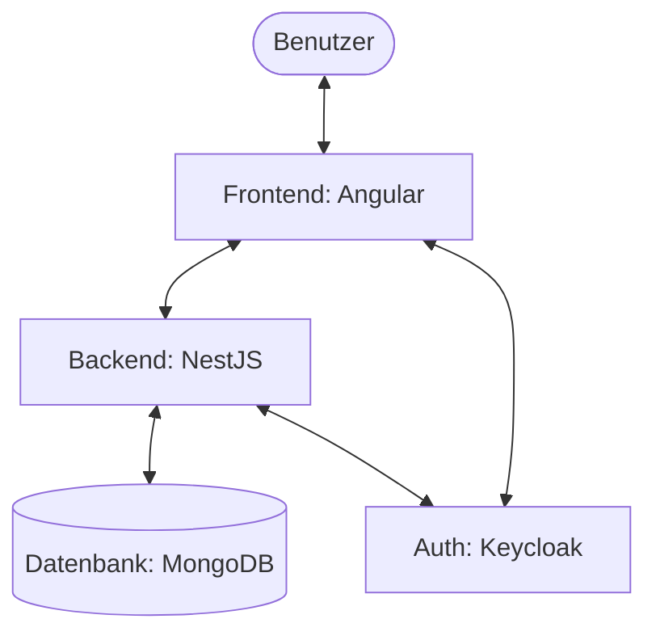
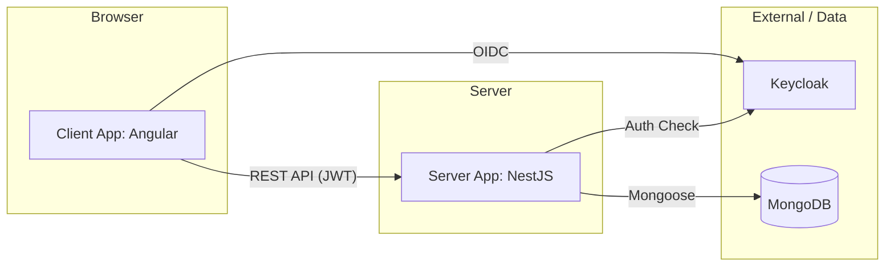
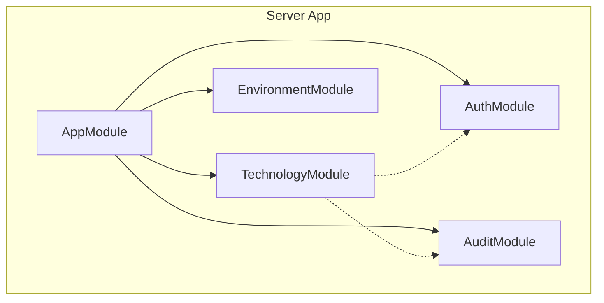
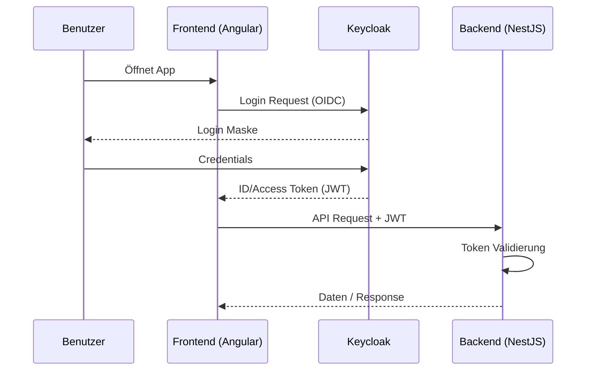
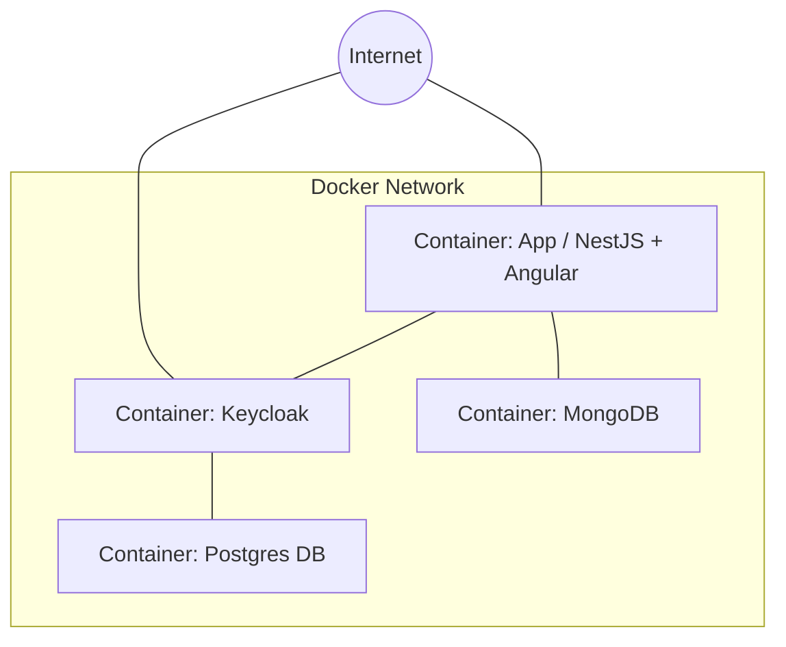

# Dokumentation WEBLAB Projekt Technologie-Radar

## 4. Fachlicher und technischer Kontext

### Fachlicher Kontext
Das Technologie-Radar dient als Software-as-a-Service (SaaS) Tool zur Verwaltung und Visualisierung von Technologietrends in einer Organisation. Das System ist in zwei Hauptbereiche unterteilt:
- **Technologie-Radar-Administration:** Ermöglicht CTOs und Tech-Leads die Erfassung, Bearbeitung und Publikation von Technologien.
- **Technologie-Radar-Viewer:** Ermöglicht allen Mitarbeitern die strukturierte Einsicht in die publizierten Technologien.

- **Rollen:** 
  - *CTO / Tech-Lead:* Berechtigt zur Administration (Login-Pflicht).
  - *Mitarbeiter:* Berechtigt zum Viewer (Login-Pflicht gemäß Story 7).
- **Kernfunktionen:** Technologien erfassen (Entwürfe), publizieren, kategorisieren (Techniques, Tools, Platforms, Languages & Frameworks) und in Ringe einordnen (Adopt, Trial, Assess, Hold).

### Technischer Kontext
Das System ist als Webapplikation konzipiert und besteht aus folgenden Komponenten:
- **Frontend (Angular):** Single-Page-Application für die Visualisierung und Verwaltung.
- **Backend (NestJS):** REST-API zur Datenverwaltung und Geschäftslogik.
- **Datenbank (MongoDB):** Speicherung der Technologiedaten und Audit-Logs.
- **Identitätsmanagement (Keycloak):** Authentifizierung und Autorisierung via OIDC.

---

## 5. Bausteinsicht

### Ebene 1: Gesamtsystem
- **Client App (Frontend):** Angular-Anwendung mit getrennten Bereichen für **Viewer** (öffentlich für Mitarbeiter) und **Administration** (geschützt für CTO/Tech-Lead).
- **Server App (Backend):** NestJS-Server für Business-Logik, Validierung der Pflichtfelder (Name, Kategorie, Ring, etc.) und Datenpersistenz.
- **Keycloak (IAM):** Zentraler Identity Provider für die Rollen-basierte Anmeldung (`CTO`, `Tech-Lead`, `User`).
- **MongoDB:** Speichert Technologien inkl. Metadaten (Erfassungs-, Publikations- und Änderungsdatum).

### Ebene 2: Server (Bausteine)
- **TechnologyModule:** Verwaltung der Technologien (CRUD, Klassifizierung).
- **AuthModule:** Integration mit OIDC und Rollenprüfung (@Roles Guard).
- **AuditModule:** Protokollierung von sicherheitsrelevanten Ereignissen (z.B. Logins).
- **EnvironmentModule:** Konfigurationsmanagement.

---

## 6. Laufzeitsicht

### Authentifizierung & Autorisierung
1. Der Nutzer öffnet die Webapp.
2. Das Frontend prüft den Login-Status via `angular-auth-oidc-client`.
3. Falls nicht eingeloggt, Weiterleitung zu Keycloak. (Home Seite kann ohne Login angezeigt werden)
4. Nach erfolgreichem Login erhält das Frontend ein JWT.
5. Das Frontend blendet verfügbare Funktionalitäten je nach Rolle ein.
6. Bei API-Anfragen wird das JWT im Authorization-Header mitgesendet.
7. Das Backend validiert das JWT und prüft Berechtigungen (z.B. Admin-Rolle für Schreibzugriffe).

### Technologie erfassen (Beispiel)
1. User sendet POST-Request an `/api/technology`.
2. `AdminLoginAuditInterceptor` registriert ggf. den Zugriff.
3. `TechnologyController` validiert die Eingabe.
4. `TechnologyService` speichert die Daten via Mongoose in MongoDB.

---

## 7. Verteilungssicht

Das System wird mittels Docker containerisiert:
- **NestJS & Angular:** Das Backend serviert das gebaute Frontend statisch (ServeStaticModule). Beides läuft in einem Container (oder separat je nach Deployment-Szenario).
- **Keycloak:** Läuft in einem separaten Container, unterstützt durch eine PostgreSQL-Instanz.
- **MongoDB:** Läuft als eigener Datenbank-Container.

---

## 8. Querschnittliche Konzepte

- **Sicherheit:** 
  - Token-basierte Authentifizierung (OIDC/JWT).
  - Role-Based Access Control (RBAC): Nur Nutzer mit Rollen `CTO` oder `Tech-Lead` haben Zugriff auf administrative API-Endpunkte.
- **Logging/Audit:** Gemäß Anforderung werden sämtliche Anmeldungen an der Administration aufgezeichnet (`AdminLoginAuditInterceptor`).
- **Datenmodellierung:** 
  - Technologien unterstützen Entwurfs- und Publikationsstatus.
  - Automatisches Tracking von Zeitstempeln (Erstellungsdatum, Publikationsdatum, Änderungsdatum).
- **Frontend-Architektur:** 
  - Responsive Design für Mobile- und Tablet-Ansicht (SCSS Media Queries).
  - Optimierte Ladezeiten für 4G-Verbindungen.

---

## 9. Architekturentscheidungen

1. **Nx Monorepo:** Zur effizienten Verwaltung von Frontend und Backend in einem Repository.
2. **NestJS & Angular:** Nutzung von TypeScript über den gesamten Stack hinweg für bessere Wartbarkeit und Typensicherheit.
3. **OIDC/Keycloak:** Nutzung bewährter Standards für Sicherheit statt Eigenbau.
4. **MongoDB:** Flexibilität bei der Beschreibung von Technologien (verschiedene Felder je nach Typ).

---

## 10. Qualitätsanforderungen

- **Benutzerfreundlichkeit:** 
  - Intuitive Visualisierung des Radars (tabellarisch/strukturiert).
  - **Mobile Optimierung:** Voll funktionsfähig auf Smartphones und Tablets.
- **Sicherheit:** 
  - Schutz der Administration durch strikte Rollenprüfung.
  - Schutz der Datenanzeige durch Authentifizierung.
- **Wartbarkeit:** Hohe Testabdeckung durch automatisierte **Unit- und Integration-Tests** für Kernfunktionen.
- **Performance:** Ladezeit des Viewers unter **1 Sekunde** bei einer Standard-4G-Verbindung (Fast 4G).
