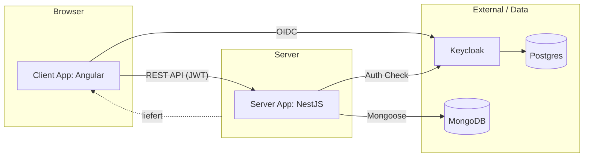
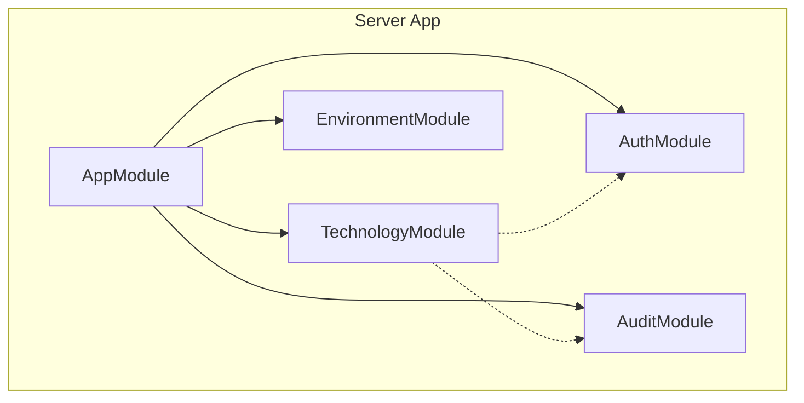
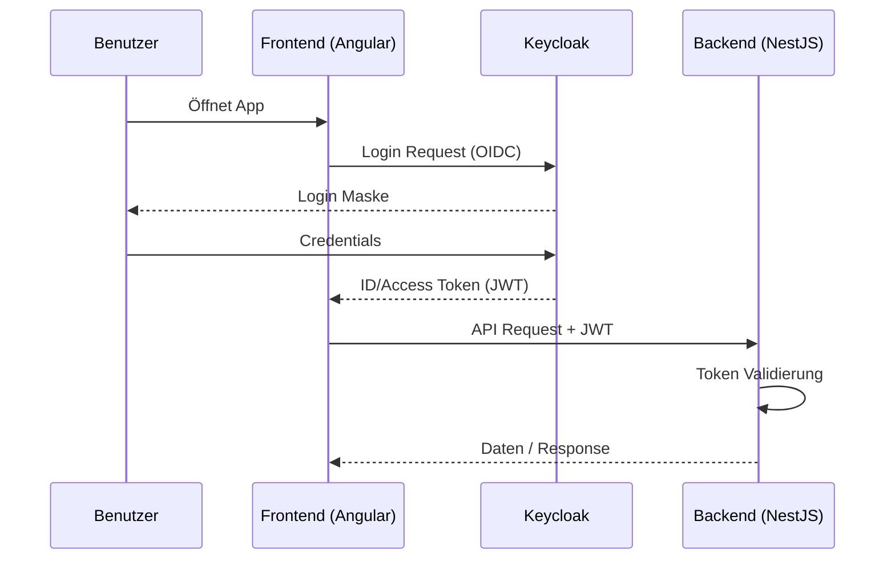
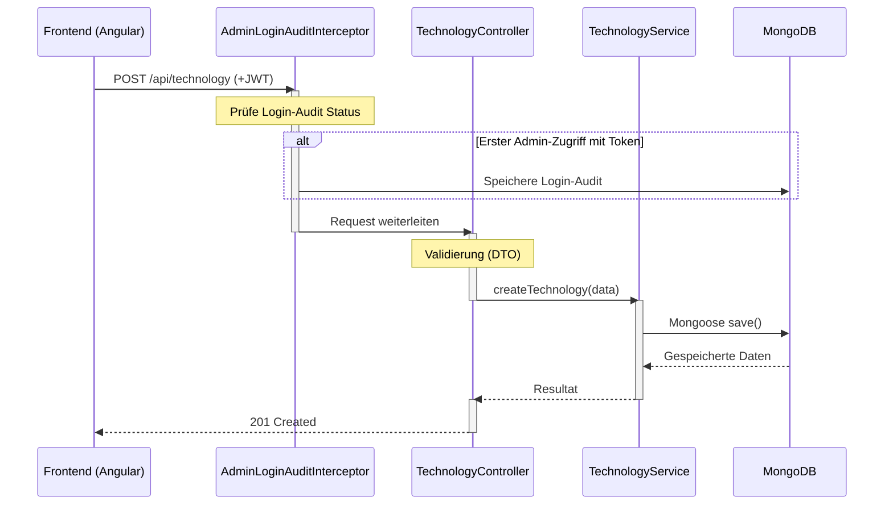

# Dokumentation WEBLAB Projekt Technologie-Radar

## 4. Fachlicher und technischer Kontext

### Fachlicher Kontext
Das Technologie-Radar dient als Software-as-a-Service (SaaS) Tool zur Verwaltung und Visualisierung von Technologietrends in einer Organisation. Das System ist in zwei Hauptbereiche unterteilt:
- **Technologie-Radar-Administration:** Ermöglicht CTOs und Tech-Leads die Erfassung, Bearbeitung und Publikation von Technologien.
- **Technologie-Radar-Viewer:** Ermöglicht allen Mitarbeitern die strukturierte Einsicht in die publizierten Technologien.

- **Rollen:** 
  - *CTO* (CTO): Berechtigt zur Administration der Technologien über die App und zum Verwalten der Nutzer im Keycloak (Login-Pflicht).
  - *Tech-Lead* (TECHLEAD): Berechtigt zur Administration der Technologien (Login-Pflicht).
  - *Mitarbeiter* (EMPLOYEE): Berechtigt zum Viewer (Login-Pflicht gemäß Story 7).
- **Kernfunktionen:** Technologien erfassen (Entwürfe), publizieren, kategorisieren (Techniques, Tools, Platforms, Languages & Frameworks) und in Ringe einordnen (Adopt, Trial, Assess, Hold).

### Technischer Kontext
Das System ist als Webapplikation konzipiert und besteht aus folgenden Komponenten:
- **Frontend (Angular):** Single-Page-Application für die Visualisierung und Verwaltung.
- **Backend (NestJS):** REST-API zur Datenverwaltung und Geschäftslogik.
- **Datenbank (MongoDB):** Speicherung der Technologiedaten und Audit-Logs.
- **Identitätsmanagement (Keycloak):** Authentifizierung und Autorisierung via OIDC.


### Schnittstellen & API-Dokumentation
Das Backend stellt eine REST-API zur Verfügung. Zur interaktiven Erkundung und als technischer Vertrag zwischen Frontend und Backend wird Swagger/OpenAPI genutzt.
Die vollständige API-Dokumentation ist zur Laufzeit der lokalen Entwicklungsumgebung unter http://localhost:3000/api/docs erreichbar.

---

## 5. Bausteinsicht

### Ebene 1: Gesamtsystem
- **Client App (Frontend):** Angular-Anwendung mit getrennten Bereichen für **Viewer** (öffentlich für Mitarbeiter) und **Administration** (geschützt für CTO/Tech-Lead).
- **Server App (Backend):** NestJS-Server für Business-Logik, Validierung der Pflichtfelder (Name, Kategorie, Ring, etc.) und Datenpersistenz.
- **Keycloak (IAM):** Zentraler Identity Provider für die Rollen-basierte Anmeldung (`CTO`, `Tech-Lead`, `Mitarbeiter`).
- **MongoDB:** Speichert Technologien inkl. Metadaten (Erfassungs-, Publikations- und Änderungsdatum).



### Ebene 2: Server (Bausteine)
- **TechnologyModule:** Verwaltung der Technologien (CRUD, Klassifizierung).
- **AuthModule:** Integration mit OIDC und Rollenprüfung (@Roles Guard).
- **AuditModule:** Protokollierung von sicherheitsrelevanten Ereignissen (z.B. Logins).
- **EnvironmentModule:** Konfigurationsmanagement.



---

## 6. Laufzeitsicht

### Authentifizierung & Autorisierung
1. Der Nutzer öffnet die Webapp.
2. Das Frontend prüft den Login-Status via `angular-auth-oidc-client`.
3. Falls nicht eingeloggt, Weiterleitung zu Keycloak. (Home Seite kann ohne Login angezeigt werden)
4. Nach erfolgreichem Login erhält das Frontend ein JWT.
5. Das Frontend blendet verfügbare Funktionalitäten je nach Rolle ein.
6. Bei API-Anfragen wird das JWT im Authorization-Header mitgesendet.
7. Das Backend validiert das JWT und prüft Berechtigungen (z.B. Admin-Rolle für Schreibzugriffe).



### Technologie erfassen (Beispiel)
1. User sendet (via Client) POST-Request an `/api/technology`.
2. `AdminLoginAuditInterceptor` registriert ggf. den Zugriff (Beim 1. Aufruf mit diesem Token / einmal pro Login).
3. `TechnologyController` validiert die Eingabe.
4. `TechnologyService` speichert die Daten via Mongoose in MongoDB.



---

## 7. Verteilungssicht

Das System wird mittels Docker containerisiert:
- **NestJS & Angular:** Das Backend hostet das gebaute Frontend statisch (ServeStaticModule). Beides läuft in einem Container oder wird direkt mit Node ausgeführt.
- **Keycloak:** Läuft in einem separaten Container, unterstützt durch eine PostgreSQL-Instanz.
- **MongoDB:** Läuft als eigener Datenbank-Container.
- **Wichtig:**
  - Die App spricht Keycloak **nicht** über den internen Docker-DNS-Namen an, sondern über den **extern erreichbaren Keycloak-Hostnamen** (z. B. per Ingress/Reverse Proxy).
  - Dies ist nur ein Beispiel des Deployments, die Systeme können auch anders (nicht über Docker) deployt werden.


---

## 8. Querschnittliche Konzepte

- **Sicherheit:** 
  - Token-basierte Authentifizierung (OIDC/JWT).
  - Role-Based Access Control (RBAC): Nur Nutzer mit Rollen `CTO` oder `Tech-Lead` haben Zugriff auf administrative API-Endpunkte. Die Rolle `Mitarbeiter` hat nur Leserechte auf die Technologien.
- **Logging/Audit:**
  - Gemäß Anforderung werden sämtliche Anmeldungen an der Administration (Rollen 'CTO' oder 'Tech-Lead') aufgezeichnet (`AdminLoginAuditInterceptor`).
  - Die Audit-Einträge können in der Datenbank oder über die API `GET /api/audit` (von der Rolle `CTO`) abgefragt werden. Sie werden aber nicht im Client dargestellt.
- **Datenmodellierung:** 
  - Technologien unterstützen Entwurfs- und Publikationsstatus.
  - Automatisches Tracking von Zeitstempeln (Erstellungsdatum, Publikationsdatum, Änderungsdatum).
    Das Kern-Datenmodell für Technologien (in MongoDB gespeichert) sieht wie folgt aus:

      ```mermaid
      erDiagram
          TECHNOLOGY {
              objectId id PK
              string name
              string description
              enum category "TECHNIQUES, TOOLS, PLATFORMS, LANGS_FRAMEWORKS"
              boolean published
              enum ring "ADOPT, TRIAL, ASSESS, HOLD" optional
              string classificationDescription optional
              date createdAt
              date publishedAt optional
              date updatedAt
          }
      ```
- **Fehlerbehandlung & Resilienz:**
  - Globale Fehlererfassung im Backend via NestJS Exception Filters (z. B. für HTTP-Fehler, Validierungsfehler oder DB-Ausfälle).
  - Im Frontend: HTTP-Interceptor fängt API-Fehler ab und zeigt sie benutzerfreundlich (z. B. via Angular Material SnackBar) an.
  - Resilienz: Automatische Retries für MongoDB-Verbindungen (via Mongoose-Options) und Graceful Shutdown bei Container-Ausfällen.
- **Frontend-Architektur:** 
  - Responsive Design für Mobile- und Tablet-Ansicht (SCSS Media Queries).
  - Optimierte Ladezeiten für 4G-Verbindungen.

---

## 9. Architekturentscheidungen

1. **Nx Monorepo:** Zur effizienten Verwaltung von Frontend und Backend in einem Repository.
2. **NestJS & Angular:** Nutzung von TypeScript über den gesamten Stack hinweg für bessere Wartbarkeit und Typensicherheit. Für NestJS wird Jest und für Angular Vite als Testruntime verwendet.
3. **OIDC/Keycloak:** Nutzung bewährter Standards für Sicherheit statt Eigenbau.
4. **MongoDB:** Flexibilität bei der Beschreibung von Technologien (verschiedene Felder je nach Typ).
5. **ESLint & Prettier:** Standardisierung der Code-Style.
6. **GitHub Actions:** Automatisierte Builds und Tests bei jedem Commit.

---

## 10. Qualitätsanforderungen

- **Benutzerfreundlichkeit:** 
  - Intuitive Visualisierung der Technologien (tabellarisch/als Radar).
  - Mobile Optimierung: Voll funktionsfähig auf Smartphones und Tablets.
  - Features, welche für eine Rolle nicht verfügbar sind, werden nicht angezeigt.
- **Sicherheit:** 
  - Schutz der Administration durch strikte Rollenprüfung.
  - Schutz der Datenanzeige durch Authentifizierung.
- **Wartbarkeit:** Hohe Testabdeckung durch automatisierte **Unit- und Integration-Tests** für Kernfunktionen.
- **Performance:** Ladezeit des Viewers unter **1 Sekunde** bei einer Standard-4G-Verbindung (Fast 4G).
